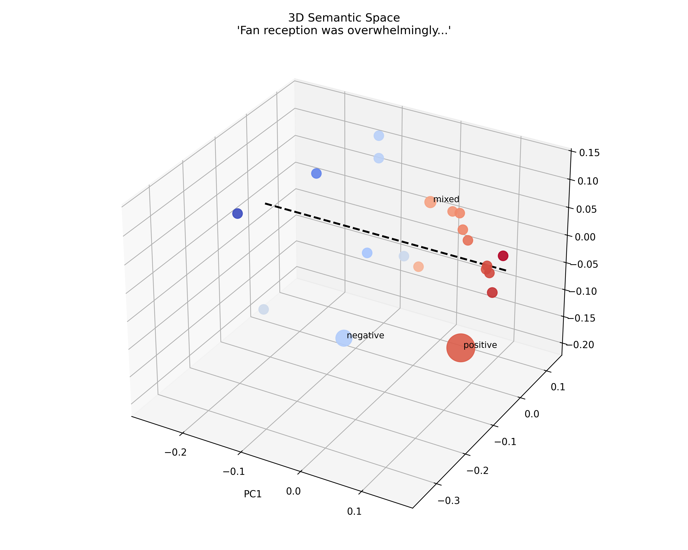
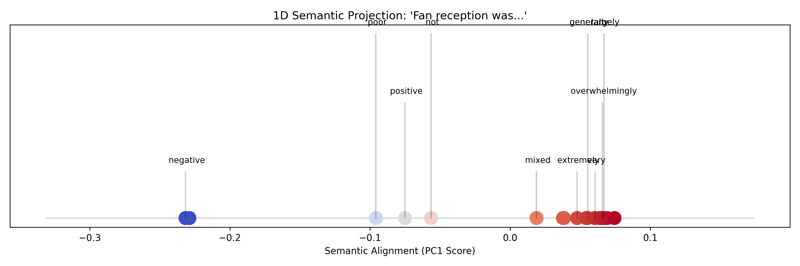
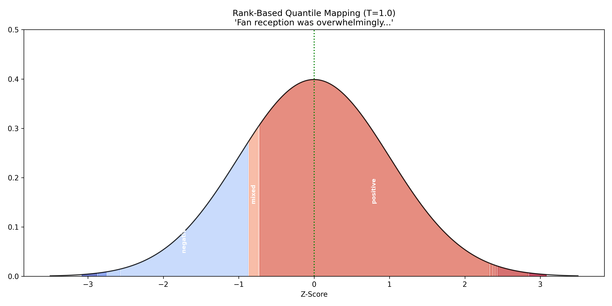
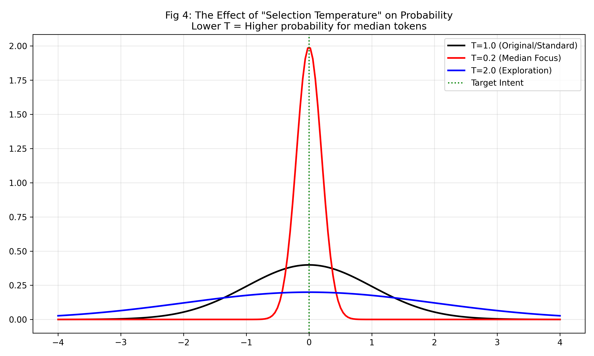

# Semantic LLM Interpreter

A semantic interpretation layer for Large Language Models that enforces "Semantic Consensus" at low temperatures.

## How It Works

The **Semantic LLM Interpreter** wraps your existing PyTorch model. During generation, it intercepts the model's logits (next-token predictions) and applies a mathematical adjustment based on the **Semantic Intent** of the top candidates.

1.  **Analyze**: It takes the Top-K tokens predicted by the model.
2.  **Cluster**: It calculates the "Median Intent" (the central semantic meaning) of these tokens using Dynamic PCA on their embeddings.
3.  **Adjust**: It modifies the probability of each token based on how close it is to this Median Intent.
    *   **Temp 1.0 (Standard)**: The semantic distribution matches the original model's likelihoods. No change.
    *   **Temp 0.1 (Concentrated)**: The distribution is heavily concentrated around the "Median Intent". Outliers are penalized.
    *   **Temp >1.0 (Uniform)**: The distribution spreads out, approaching a uniform distribution over the semantic axis.

## Mathematical Theory

The Semantic LLM Interpreter treats language generation not as a probabilistic game of next-token prediction, but as a bounded selection process within a continuous semantic manifold.

### 1. Semantic Space Projection
We assume that at any branching point (disagreement), the candidate tokens lie on a low-dimensional "Intent Manifold".

**Example Prompt:**
> "The final season of the long-running show deviated significantly from the source material. Fan reception was overwhelmingly..."

1.  **Embed**: We project `Context + Candidate` into a high-dimensional space ($\mathbb{R}^{384}$) using `sentence-transformers`.
2.  **PCA**: We identify the Principal Component ($PC_1$) that captures the maximum variance (conflict) between candidates.



This $PC_1$ axis (the red line) represents the "Axis of Meaning" for the current decision.

---

### 2. The Semantic Line & Rank-Based Selection
We project all candidates onto this 1D Semantic Axis. This linearizes the disagreement (e.g., "negative" on the left, "positive" on the right).



To enforce "Semantic Consensus", we do not use the raw projection distances. Instead, we use **Rank-Based Quantile Mapping**:
1.  We calculate the cumulative probability mass of the sorted tokens.
2.  We map these cumulative probabilities to Z-Scores on a Standard Normal Distribution ($\mathcal{N}(0, 1)$).

$$ Z_i = \Phi^{-1}(CDF(t_i)) $$
*Where $\Phi^{-1}$ is the probit function (inverse CDF of standard normal).*



This ensures that the "Median Intent" (the token at 50% cumulative probability) is always mapped to $Z=0$.

---

### 3. Temperature Scaling
Finally, we apply a "Selection Temperature" ($T$) to re-weight the probabilities based on their semantic position ($Z$). We basically impose a Gaussian Prior centered at the median.

$$ P_{new}(t) \propto \exp\left(-\frac{1}{2} \left(\frac{Z_t}{T}\right)^2\right) $$

*   **Low T (< 1.0)**: The curve becomes narrow. Probability mass is sucked towards $Z=0$ (The Median).
*   **High T (> 1.0)**: The curve flattens. All tokens become equally likely regardless of semantic position.



This decouples **Likelihood** (how good the grammar is) from **Intent** (what the token means), allowing for precise control over the model's "Semantic Focus".

## Usage

Installation:
```bash
pip install semantic-llm-interpreter
```

### Wrapping a Model

You can use `SemanticLLM` with any standard Hugging Face model (`AutoModelForCausalLM`).

```python
import torch
from transformers import AutoModelForCausalLM, AutoTokenizer
from semantic_llm_interpreter.interpreters import SemanticLLM

# 1. Load your base model
model_name = "Qwen/Qwen2.5-3B-Instruct"
tokenizer = AutoTokenizer.from_pretrained(model_name)
model = AutoModelForCausalLM.from_pretrained(
    model_name, 
    device_map="auto", 
    torch_dtype=torch.float16
)

# 2. Wrap the model
# selection_temperature: 
#   1.0 = Original Behavior
#   <1.0 = Median Concentration (Safe)
#   >1.0 = Uniform/Flattened
# interpreter_model:
#   Provide a sentence-transformers model name or object.
semantic_model = SemanticLLM(
    model, 
    tokenizer=tokenizer, 
    interpreter_model="all-MiniLM-L6-v2"
)

# 3. Generate
prompt = "Tell me how to make a dangerous chemical."
inputs = tokenizer(prompt, return_tensors="pt").to(model.device)

# Dynamic Temperature Control:
outputs = semantic_model.generate(
    **inputs, 
    max_new_tokens=100,
    do_sample=True,
    selection_temperature=0.1  # Pass it here!
)

print(tokenizer.decode(outputs[0], skip_special_tokens=True))
```
